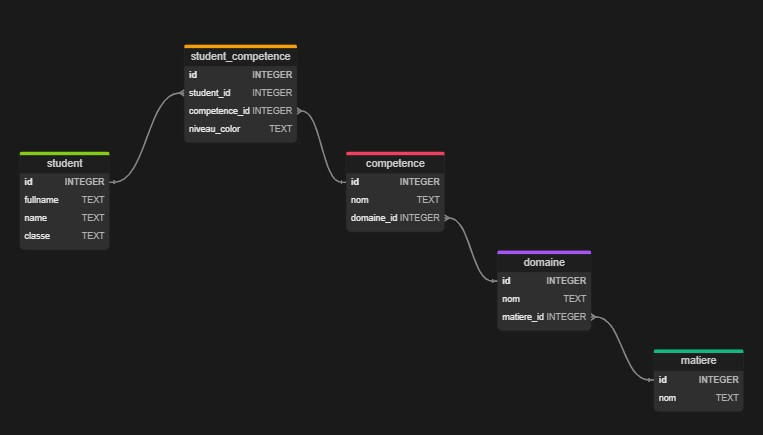

# Teacher Administration


Teacher Administration is a web application designed to help teachers manage students, subjects, domains, and competencies. The application allows teachers to add, view, and delete students, subjects, domains, and competencies. It also provides functionality to assign competencies to students and export student competency reports as PDFs.

## Features

- Add, view, and delete students
- Add, view, and delete subjects
- Add, view, and delete domains
- Add, view, and delete competencies
- Assign competencies to students
- Export student competency reports as PDFs

## Installation

1. Clone the repository:
    ```sh
    git clone <repository-url>
    ```
2. Navigate to the project directory:
    ```sh
    cd teacheradministration
    ```
3. Install the dependencies:
    ```sh
    npm install
    ```

## Usage

1. Start the server:
    ```sh
    npm start
    ```
2. Open your web browser and navigate to `http://localhost:3000`.

## Launch with HTTPS

1. Ensure you have the necessary SSL certificates (`server.key` and `server.cert`) in the `certs` directory.
2. Start the server with HTTPS:
    ```sh
    node index.js
    ```
3. Open your web browser and navigate to `https://localhost:3000`.

## Node Modules

The project uses the following Node modules:

- **express**: A minimal and flexible Node.js web application framework that provides a robust set of features for web and mobile applications.
- **ejs**: Embedded JavaScript templates, a simple templating language that lets you generate HTML markup with plain JavaScript.
- **pdfkit**: A JavaScript PDF generation library for Node and the browser.
- **pdfkit-table**: A plugin for PDFKit to create tables in PDF documents.
- **serve-favicon**: A favicon serving middleware for Node.js.
- **sqlite3**: Asynchronous, non-blocking SQLite3 bindings for Node.js.

## Routes

- `/` - Home page
- `/students` - View list of students
- `/addstudent` - Add a new student
- `/deletematiere/:id` - Delete a subject
- `/domaine` - View list of domains
- `/adddomaine` - Add a new domain
- `/deletedomaine/:id` - Delete a domain
- `/competence` - View list of competencies
- `/addcompetence` - Add a new competence
- `/deletecompetence/:id` - Delete a competence
- `/assigncompetences` - Assign competencies to students
- `/notespareleve` - View student competency notes
- `/getCompetencesByStudent` - Get competencies by student
- `/exportPdf` - Export student competency report as PDF

## Database



The application uses SQLite for data storage. The database schema includes the following tables:

- `student`
- `matiere`
- `domaine`
- `competence`
- `student_competence`

## License

This project is licensed under the ISC License.